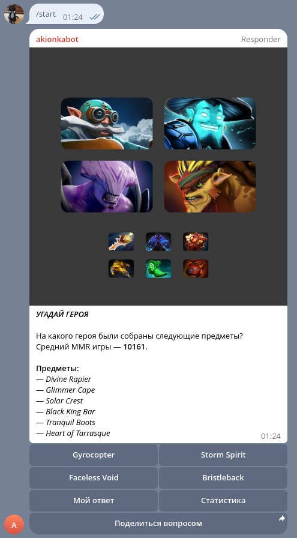
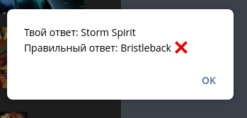
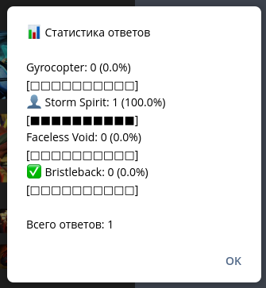

# Guess the Hero Bot

> Guess the Hero Bot is an entertaining bot designed to challenge users to guess a hero based on an item build in a specific Dota 2 match.

## Features

- Fetches quiz data from [D2PT](https://dota2protracker.com).
- Fetches full match data from [Stratz](https://stratz.com).
- Caches data from D2PT and Stratz.
- Stores fetched data in PostgreSQL database.
- Stores hero and item images in S3-like minio.
- Generates quiz image on the fly or takes already generated from the database.
- Interacts with users via Telegram, stores their answers.

## Install & Run

1. Clone the repository:

   ```bash
   git clone https://github.com/Akionka/guess-the-hero-bot.git
   cd guess-the-hero-bot
   ```

2. Edit docker-compose.yml to reflect your environment.

3. Build and run the bot using Docker Compose:

   ```bash
   docker-compose up --build -d
   ```

4. Connect to 127.0.0.1:8200 and set up Vault.

5. Rename .env.example to .env and set the `VAULT_TOKEN` variable with your Vault token.

6. Restart the bot:

   ```bash
   docker-compose restart app
   ```

7. The bot will start and listen for commands. You can interact with it through Telegram.

## Screenshots





